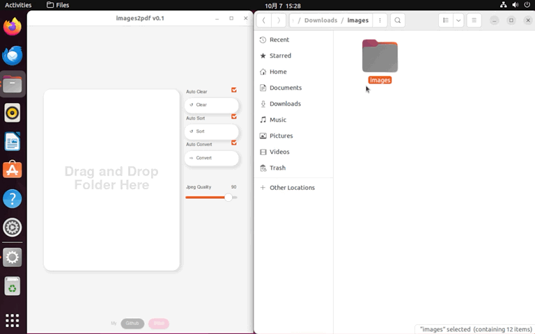
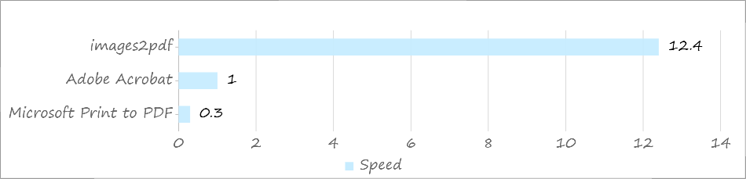

# Images to PDF

An efficient image sequence to PDF converter that can utilize all CPU cores. 

一个能够利用所有CPU核心的高效图像序列到PDF转换器。





## Get Start

Download the executable file here: https://github.com/CatScarf/images2pdf/releases


## Build from Source

Before building, make sure you have installed [NPM](nodejs.org) and [Cargo](www.rust-lang.org/learn/get-started).

```bash
git clone git@github.com:CatScarf/images2pdf.git
cd images2pdf
npm install
npm run tauri build
```

You can find the executable file in `images2pdf\src-tauri\target\release`.